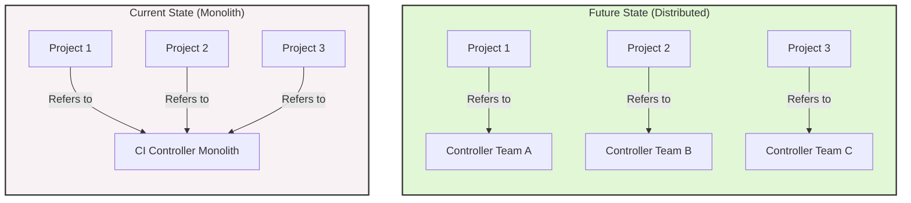
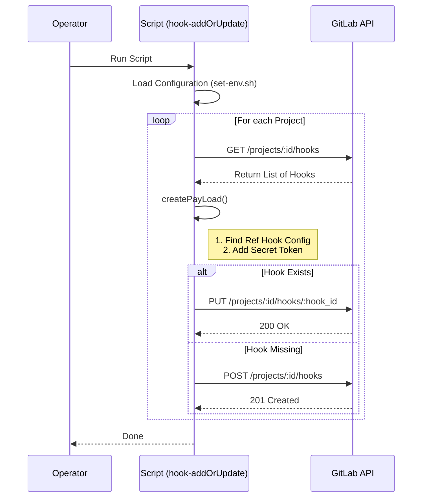

# GitLab Webhook Management Scripts

This repository contains 3 scripts to manage webhooks in GitLab projects:

- [hook-addOrUpdate.sh](hook-addOrUpdate.sh): **Smart Add/Update**. Adds a webhook to a list of projects by copying permissions from an **existing** hook (Reference URL) to a new Target URL. If the Target URL already exists, it updates it. *Note: Requires the Reference URL to exist on the project.*
- [hook-add-simple.sh](hook-add-simple.sh): **Simple Add (Bootstrap)**. Adds a webhook with default permissions to a list of projects. Use this for adding hooks to new projects that have none.
- [hook-delete.sh](hook-delete.sh): Deletes a webhook (Target URL) from a list of projects.
- [set-env.sh.template](set-env.sh.template): Common configurations for the scripts.

## Architecture Migration

These scripts allow for moving from a Monolithic CI Controller reference to Dedicated Controllers per project/team.




## Sequence Diagram



## Configuration

Create your copy of the `set-env.sh` and adjust your variables:
    
```bash
  cp set-env.sh.template set-env.sh
```
Both scripts read their configuration from the top of the file. You need to set the following variables in `set-env.sh`:

- `GITLAB_TOKEN`: Your GitLab Personal Access Token with `api` scope.
- `WEBHOOK_TARGET`: The URL of the webhook to add or delete.
- `PROJECTS`: A list of project paths or numeric IDs.

**For `hook-addOrUpdate.sh` specifically:**
- `WEBHOOK_REFERENCE_URL`: (Optional) The URL of the existing hook *on the same project* to copy permissions from. If unset, it will look for `WEBHOOK_TARGET` to update itself.
- `WEBHOOK_SECRET`: (Optional) The secret token for the hook.

## Usage

1. Copy the `set-env.sh.template` to `set-env.sh` and adjust your variables:
```bash
  cp set-env.sh.template set-env.sh
```


2. Make the scripts executable:
```bash
chmod +x hook-addOrUpdate.sh
chmod +x hook-add-simple.sh
chmod +x hook-delete.sh
```
3. Run the desired script:
```bash
./hook-add-simple.sh
# or
./hook-delete.sh
# or
./hook-addOrUpdate.sh
```

# Example Configurations

## Example 1: Add or Update Webhook (Default Payload)

This configuration adds or updates the `WEBHOOK_TARGET` on all projects in the `GITLAB_GROUP`.
Since no `WEBHOOK_REFERENCE_URL` is configured, the default payload is used.

**Default Payload:**
```json
{
  "url": "https://webhook.example.com/hook",
  "push_events": true
}
```

**`set-env.sh` configuration:**
```bash
#!/bin/bash

# --- CONFIGURATION ---
# Your GitLab Personal Access Token (Scope: api)
export GITLAB_TOKEN="glpat-..."

# The Webhook URL you want to add/update
export WEBHOOK_TARGET="https://ci.webhook.example.com/hook"

# The Base API URL (Change if using self-hosted GitLab)
export API_URL="https://gitlab.com/api/v4"

# The GitLab Group that contains the projects
export GITLAB_GROUP="gitlabgroup1"

# List of GitLab Project Paths (will be concatenated to GITLAB_GROUP/PROJECT_NAME)
export PROJECTS=(
    "PROJECT_NAME1"
    "PROJECT_NAME2"
    "PROJECT_NAME3"
)
```

## Example 2: Copy Configuration from Existing Webhook

If `WEBHOOK_REFERENCE_URL` is set, the script copies the configuration (permissions, events, SSL settings) from that reference hook instead of using the defaults.

**Example Payload copied from Reference:**
```json
{
  "url": "https://webhook.example.com/hook",
  "push_events": true,
  "tag_push_events": true,
  "merge_requests_events": true,
  "enable_ssl_verification": true,
  "issues_events": true,
  "note_events": true
}
```

**`set-env.sh` (additions):**
```bash
# Reference Origin Webhook URL 
# (The settings from this hook will be copied to the new WEBHOOK_TARGET)
export WEBHOOK_REFERENCE_URL="https://ci.webhook.example.com/hook"
```

## Example 3: Secure Webhook with Secret Token

Setting the `WEBHOOK_SECRET` variable adds a secret token to the webhook payload. This is highly recommended for security.

**Payload with Secret:**
```json
{
  "url": "https://webhook.example.com/hook",
  "token": "your_secure_secret_token",
  ...
}
```

**`set-env.sh` (additions):**
```bash
export WEBHOOK_SECRET="your_secure_secret_token"
```


# Manual step-by-step guide to securely connecting GitLab to Jenkins using a Secret Token.

## 1. Generate a Secret Token

First, generate a strong random string. This will be the "password" that GitLab sends and Jenkins verifies.

Run this in your terminal:

```bash
openssl rand -hex 20
# Example Output: 9f3b2049d5a86374827d9401235a86493820a1b2

```

*Copy this string. You will need to paste the exact same string into both systems.*

---

## 2. Configure Jenkins (The Receiver)

You need to tell Jenkins to expect this specific token.

1. **Navigate to your Job:** Open the specific Jenkins Job (or Multibranch Pipeline) you want to trigger.
2. **Configure:** Click **Configure** in the left sidebar.
3. **Build Triggers:** Scroll down to **Build Triggers**.
4. **Enable GitLab:** Check the box **"Build when a change is pushed to GitLab. GitLab webhook URL: ..."**
5. **Advanced Settings:** Click the **Advanced...** button inside that section.
6. **Set the Token:**
* Locate the **Secret token** field.
* Paste the token you generated in Step 1.
* *Note: If you leave this empty, anyone on the internet can trigger your builds.*


7. **Save:** Click **Save**.

---

## 3. Configure GitLab (The Sender)

Now configure GitLab to send that token with every request.

1. **Navigate to Project:** Open your repository in GitLab.
2. **Settings:** Go to **Settings > Webhooks** (left sidebar).
3. **Add new webhook:**
* **URL:** Paste your Jenkins Webhook URL (e.g., `https://jenkins.company.com/project/my-job`).
* **Secret Token:** Paste the **same token** from Step 1.
* **Trigger:** Check "Push events" and "Merge request events".
* **SSL verification:** Uncheck this ONLY if you are using a self-signed certificate (like in a dev environment).


4. **Save:** Click **Add webhook**.

---

## 4. Verify the Connection

1. **Test via GitLab:**
* Scroll down to the webhook you just created in GitLab.
* Click **Test > Push events**.
* You should see a blue bar appear at the top saying `Hook executed successfully: HTTP 200`.


2. **Check Jenkins:**
* Look at the build history of your Jenkins job. You should see a new build starting.


## Troubleshooting Common Errors

| Error Code | Meaning | Fix |
| --- | --- | --- |
| **403 Forbidden** | The tokens do not match. | Re-paste the token in both Jenkins and GitLab to ensure they are identical. |
| **401 Unauthorized** | Jenkins Authentication is blocking the request. | Ensure your "GitLab Plugin" configuration in **Manage Jenkins > System** allows unauthenticated access for webhooks (this is safe because the Secret Token provides the security). |
| **404 Not Found** | Wrong URL. | Check that the URL in GitLab matches exactly what Jenkins displayed in Step 2.4. |
