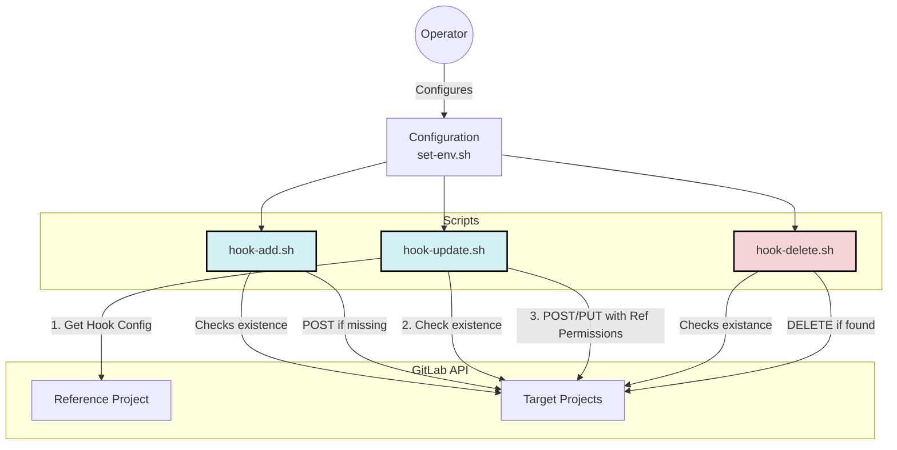

# GitLab Webhook Management Scripts

This repository contains 3 scripts to manage webhooks in GitLab projects:

- [hook-add.sh](hook-add.sh): Adds a webhook to a list of projects.
- [hook-update.sh](hook-update.sh): Adds or Updates a webhook on a list of projects, copying permissions from a reference hook.
- [hook-delete.sh](hook-delete.sh): Deletes a webhook from a list of projects.
- [set-env.sh.template](set-env.sh.template): Common configurations for both hook script (above). 
>  cp set-env.sh.template set-env.sh

## Workflow Diagram



## Configuration

Create your copy of the `set-env.sh`and adjust your variables
    
```bash
  cp set-env.sh.template set-env.sh
```
Both scripts read their configuration from the top of the file. You need to set the following variables in `set-env.sh`:

- `GITLAB_TOKEN`: Your GitLab Personal Access Token with `api` scope.
- `WEBHOOK_TARGET`: The URL of the webhook to add or delete.
- `PROJECTS`: A list of project paths or numeric IDs.

**For `hook-update.sh` specifically:**
- `REFERENCE_PROJECT`: The project to copy hook permissions from.
- `WEBHOOK_REFERENCE_URL`: The URL of the specific hook on the reference project.
- `WEBHOOK_SECRET`: (Optional) The secret token for the hook.

## Usage

2. Make the scripts executable:
```bash
chmod +x hook-add.sh
chmod +x hook-delete.sh
chmod +x hook-update.sh
```
3. Run the desired script:
```bash
./hook-add.sh
./hook-delete.sh
./hook-update.sh
```
